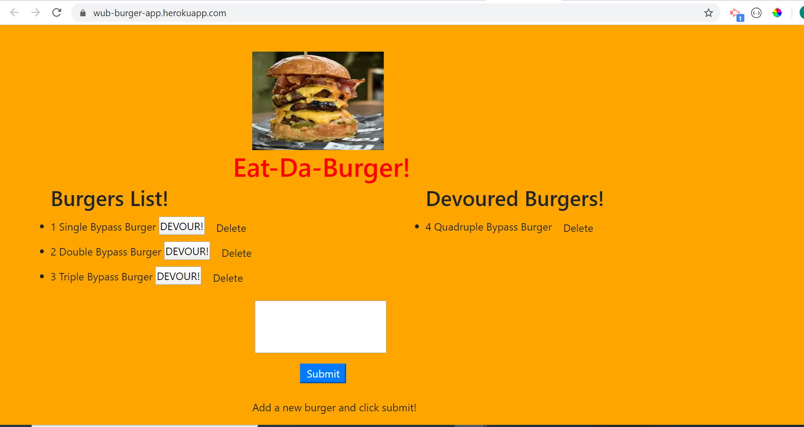

# burgers

## Table of Contents
<!--ts-->
   * [Project Description](#project-description)
   * [Technologies Used](#technologies-used) 
   * [Dependencies](#dependencies)
   * [Tests](#tests)
   * [Using Repo](#using-repo)
   * [Contributing to the repo](#contributing-to-the-repo)
   * [Licenses](#licenses)
   * [Inquiries](#inquiries)
   * [Developer Info](#developer-info)
<!--te-->
## Project Description
A burger logger application with MySQL, Node, Express, Handlebars and homemade ORM thatcreates a list of burgers that can be devoured or deleted. Devoured burgers will be displayed in a seprate list

Project url: 
(https://github.com/wayele/burgers)

## Screenshots
User can add a new burger to list and devour any burger from that list. Once devoured that burger will move to the "Devoured List"

## Technologies Used
html, CSS, Bootstrap, JavaScript, MySQL, Node, Express, Handlebars, ORM

## Dependencies
npm install
## Tests
no tests
## Using Repo
in order to deploy application to heroku a JAWSDB remote database was created
## Contributing to the repo
contributions to improve functionality of application are welcome
## Licenses

MIT
## Inquiries
Yes

ayele.wub@gmail.com
## Developer Info:

Github username: wayele

Email: ayele.wub@gmail.com
